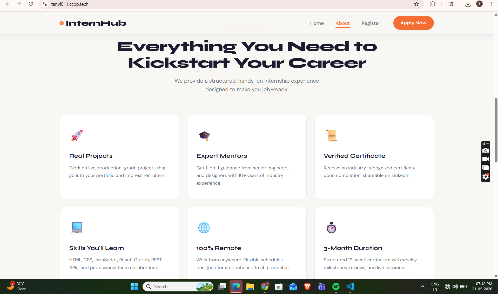
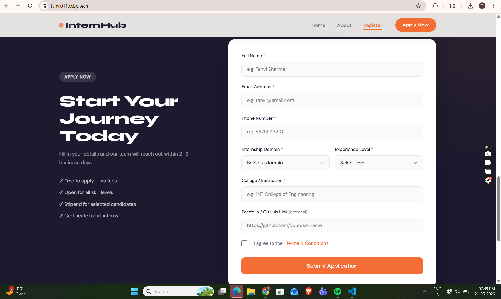
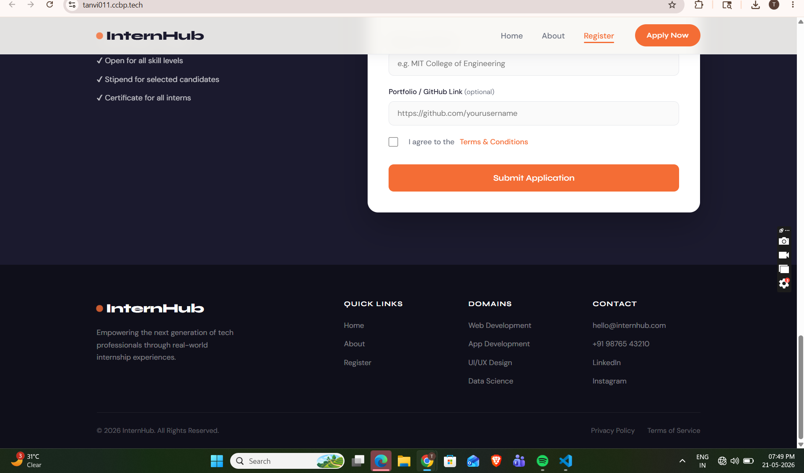

<div align="center">

# 🚀 InternHub — Internship Registration Landing Page

### Web Development Internship Assessment · Summer 2026

[](https://tanvi011.ccbp.tech/)
[](https://developer.mozilla.org/en-US/docs/Web/HTML)
[](https://developer.mozilla.org/en-US/docs/Web/CSS)
[](https://developer.mozilla.org/en-US/docs/Web/JavaScript)

</div>

---

## ✨ What Is This?

**InternHub** is a fully responsive internship registration landing page — built as part of the *Web Development Internship Assessment*. It helps aspiring tech professionals discover, learn about, and apply for a structured 12-week internship program — all from one beautifully designed page.

> 💡 *"Built with clean code, designed for real users."*

---

## 🎯 Live Preview

🔗 **[https://tanvi011.ccbp.tech/](https://tanvi011.ccbp.tech/)**

---

## 📋 Sections Included

| # | Section | Description |
|---|---------|-------------|
| 1 | 🔝 **Navbar** | Sticky navigation with smooth scroll links and CTA button |
| 2 | 🌟 **Hero Section** | Bold headline, program highlights, and dual CTA buttons |
| 3 | 📖 **About Internship** | Feature cards showcasing program benefits and skills |
| 4 | 📝 **Registration Form** | Multi-field form with complete JavaScript validation |
| 5 | 🦶 **Footer** | Links, contact info, domains, and social handles |

---

## 🛠️ Technologies Used

```
├── HTML5      →  Semantic structure and layout
├── CSS3       →  Responsive design, flexbox, animations
└── JavaScript →  Form validation, interactivity, DOM manipulation
```

---

## ✅ Features

- 📱 **Fully Responsive** — works on mobile, tablet, and desktop
- 🎨 **Clean Modern UI** — minimal, professional aesthetic
- ✔️ **Form Validation** — real-time JS validation for all fields
  - Name (min. 3 characters)
  - Valid email format
  - 10-digit phone number
  - Domain & experience level selection
  - College name required
  - Optional portfolio URL (must start with `https://`)
  - Terms & Conditions checkbox
- 🎉 **Success State** — animated confirmation message on submit
- 🔗 **Smooth Scrolling** — seamless section navigation

---

## 📁 Project Structure

```
internship-registration-landing-page/
│
├── index.html       ← Main HTML structure
├── style.css        ← All styling and responsive design
├── script.js        ← Form validation and JS interactions
└── README.md        ← You're reading this!
```

---

## 🚀 How to Run Locally

```bash
# 1. Clone the repository
git clone https://github.com/your-username/internship-registration-landing-page.git

# 2. Open the folder
cd internship-registration-landing-page

# 3. Open index.html in your browser
# Just double-click index.html — no setup needed!
```

---

## 📸 Screenshots


### 🌟 Hero Section


### 📖 About Section


### 📝 Registration Form


### 🦶 Footer


---

## 👩‍💻 Author

**Tanvi**
Made with 💜 as part of the Web Development Internship Assessment

---

<div align="center">

*© 2026 InternHub · All Rights Reserved*

</div>
